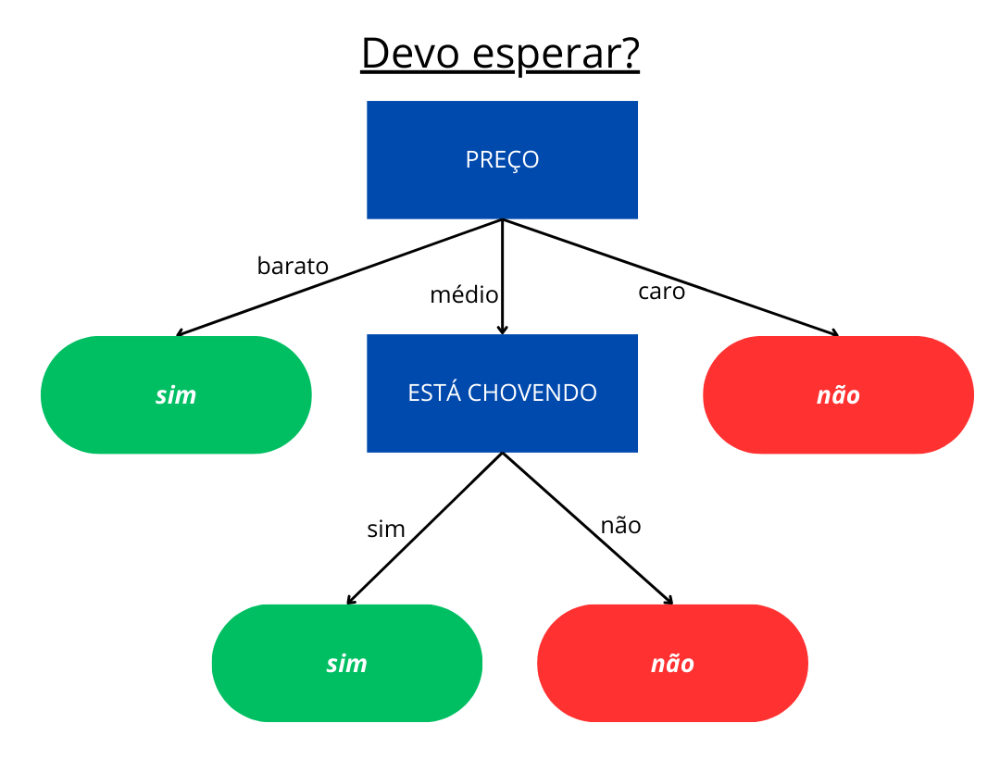

# Decision Tree Learning

Uma implementação de um algoritmo de **Árvore de Decisão** baseado em entropia, criada em Python. Este projeto visa ilustrar os conceitos de aprendizado supervisionado por meio de uma implementação prática e acessível.

---

## Índice
1. [Descrição](#1-descrição)
2. [Como Usar](#2-como-usar)
3. [Exemplo de Funcionamento](#3-exemplo-de-funcionamento)
4. [Ilustração de uma Árvore](#4-visualização-da-árvore)

---

## 1. Descrição

Este projeto implementa uma **Árvore de Decisão** personalizada, usando o cálculo da **entropia** para selecionar os melhores atributos. É ideal para aprender como árvores de decisão funcionam e podem ser usadas em problemas de classificação.

### Funcionalidades:
- Fácil de usar e integrar com seus próprios datasets.
- Implementação pura, sem bibliotecas externas específicas para algoritmos de aprendizado supervisionado.

---


## 2. Como Usar

Você precisará ter python instalado em sua máquina.
Primeiramente clone o repositório para a sua máquina local:

   ```bash
   git clone https://github.com/kauancarlosrf/decision-tree-learning.git
   cd decision-tree-learning
   ```

Depois disso rode o código:

  ```
  python3 usandoLibArvore.py
  ```

No log de seu console irá sair as decisões (respostas das árvores).

---


## 3. Exemplo de Funcionamento

Há no arquivo dataSet.py um conjunto de dados a respeito de um restaurante e a respeito de partidas de futebol. Ambos serão para criar e treinar árvores diferentes.

No arquivo arvore.py está de fato o código que cria e treina uma árvore. Ao importar a função construir_arvore() você consegue passar como 1ºparâmetro um objeto de dados e como 2ºparâmetro outro objeto, porém apenas com as decisões ordenadas de acordo com os dados do 1º parâmetro.

| Preço     | Dia da Semana | Está Chovendo     | Vai Esperar |
|-----------|---------------|-------------------|-------------|
| barato    | sexta         | não está chovendo | sim         |
| médio     | sábado        | está chovendo     | não         |
| caro      | segunda       | não está chovendo | não         |
| barato    | sexta         | está chovendo     | sim         |

Uma árvore de decisão gerada poderia ser algo assim:

Preço?
- barato: sim
- médio: Está chovendo? 
  - não: sim
  - sim: não
- caro: não

---


## 4. Ilustração de uma Árvore

Um modo de ilustrar e esquematizar os passos lógicos que a árvore faz é:


